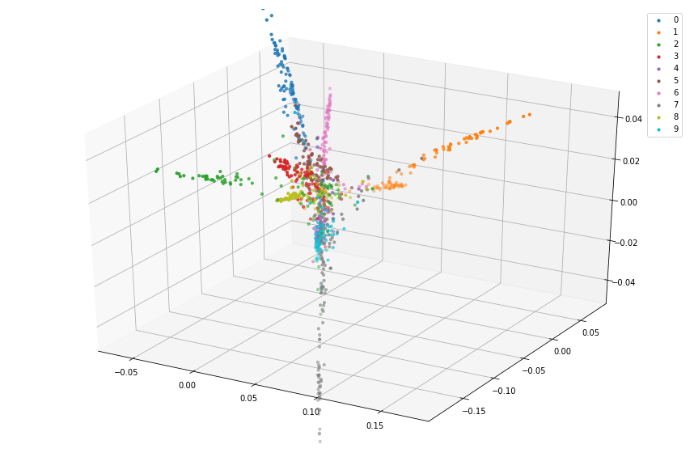

# graph_embeddings
This project is about three Factorization-based graph embedding techniques : Laplacian eigenmaps, Cauchy embeddings and Factorization Graph. 

The methods were implemented in Python 3.6, and tested on MNIST dataset. An mnist.py file was creating to ease the loading process of MNIST data.

Here is some nice results we obtained, with the Laplacian eigenmaps, after applying some PCA preprocessing trick.

